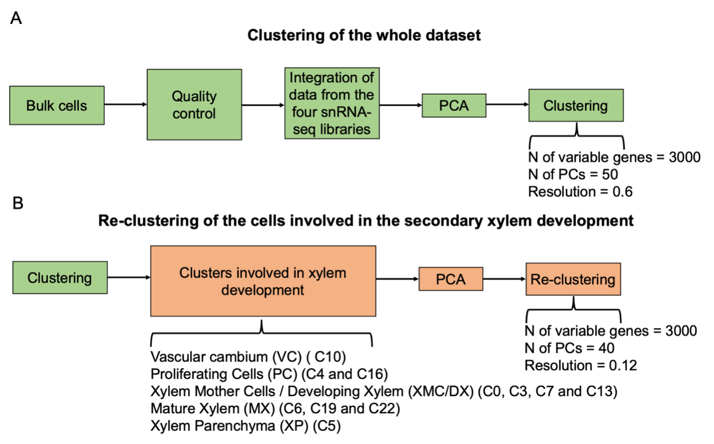

## Single-nucleus transcriptomics revealed auxin-driven mechanisms of wood plasticity to enhance severe drought tolerance in poplar

### Introduction

This repository contains the necessary code to reproduce the results described in "Single-nucleus transcriptomics revealed auxin-driven mechanisms of wood plasticity to enhance severe drought tolerance in poplar", from Gómez-Soto et al. 2025 and published in the journal Genome Biology.

The dataset used in this study is available at the NCBI Gene Expression Omnibus and are accessible through accession number [GSE283835](https://www.ncbi.nlm.nih.gov/geo/query/acc.cgi?acc=GSE283835).

Clustered datasets can be downloaded from FigShare at 10.6084/m9.figshare.29228876.

### First steps

The integration of the four single-nucleus RNA-seq datasets, quality control, and clustering was performed using the web application [Asc-Seurat, v.2.2](https://asc-seurat.readthedocs.io/en/latest/index.html). Asc-Seurat is based on the Seurat package v4. 

For the quality control and data integration, the parameters are provided to Asc-Seurat in the CSV (comma-separated values) file `asc_seurat_params.csv`, attached to this repository.

Min.Cell = used to filter out genes expressed in less than this number of cells.
Min.Genes = used to filter out cells with less than this number of genes expressed.
Max.Genes = used to filter out cells with more than this number of genes expressed (possible doublets).
Max.Mito = used to filter out cells with more than this percentage of mitochondrial genes expressed.

The main steps of the clustering and the used parameters are described in the image below.



### Downstream analysis

#### Differential expression analysis

The differential expression analysis was performed using the R script `script1_differential_expression.R`, which can be executed as follows:

```terminal
Rscript script1_differential_expression.R
```

#### GO term enrichment analysis

The GO term enrichment analysis was performed using the R script `script2_go_enrichment.R`, which can be executed as follows:

```
Rscript script2_GO_enrichment_analysis.R
```

#### Trajectory inference and differential expression analysis

All steps of the trajectory inference and differential expression analysis were performed using the R script `script1_trajectory_inference.R`, which can be executed as follows:

```terminal
Rscript script3_trajectory_inference.R
```

#### hdWGCNA

All steps of the hdWGCNA analysis were performed using the R script `script2_hdWGCNA.R`, which can be executed as follows:

```terminal
Rscript script4_hdWGCNA.R
```

#### Visualization of the results

Other scripts necessary to generate the figures and tables of the manuscript are provided in this repository in the `other_scripts` folder. 
